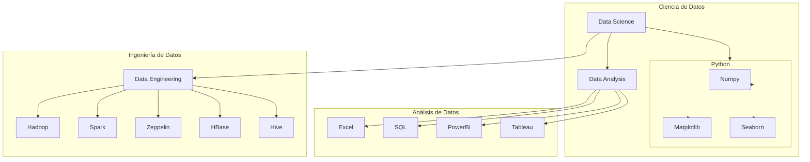

"# proyecto-colaborativo" 
Hola soy Jesus
hola que tal 

```mermaid
graph TD;
    subgraph Ciencia de Datos
        DataScience[Data Science] --> DataAnalysis[Data Analysis]
        DataScience --> Python[Python]
    end

    subgraph Análisis de Datos
        DataAnalysis --> Excel
        DataAnalysis --> SQL
        DataAnalysis --> PowerBI
        DataAnalysis --> Tableau

    end

    subgraph Python
        Python --> Numpy
        
        Python --> Matplotlib
        Python --> Seaborn
                
    end

    subgraph Ingeniería de Datos
        DataEngineering[Data Engineering] --> Hadoop
        DataEngineering --> Spark
        DataEngineering --> Zeppelin
        DataEngineering --> HBase 
        DataEngineering --> Hive

    end

    DataScience --> DataEngineering
```

